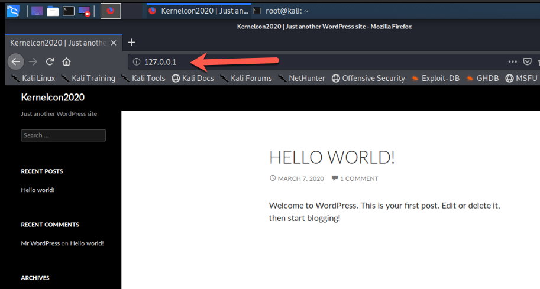

# Exercise #10 - Scaling workloads
## Preface:
#### If your a developer or infrastructure type person, you may remember how difficult it was in the past to scale your applications. One had to build new servers, patch them, hope you had all the same settings and libraries installed before you could even think about installing the code. k8s makes this trivial in that it manages all the scheduling and "deploying" of your ___"code"___ or ___'workload"___ as we will see in this segment. If you can keep all your declarative descriptions of how you want your code to run "be configured" and where. Then k8s can make this very very easy.

### For visibility we will be ___"spinning up"___ a secondary console to view our pods (containers) and services. It's just a way for us to see what is going on inside of kubernetes. The kubernetes dashboard could be used for this purpose but "speak8" is just a nicer visual.

### You should still have your "wordpress" deployment running. (please check)
```bash
# kubectl get pods,svc
NAME                             READY   STATUS    RESTARTS   AGE
pod/mysql-6c8b769d74-sd5f6       1/1     Running   0          35m
pod/wordpress-6d949c5b75-6bk2h   1/1     Running   0          35m

NAME                 TYPE        CLUSTER-IP     EXTERNAL-IP   PORT(S)    AGE
service/kubernetes   ClusterIP   10.96.0.1      <none>        443/TCP    58m
service/mysql-svc    ClusterIP   10.96.17.119   <none>        3306/TCP   35m
```
Lets say your workpress site is under more load, now that it's so popular. From a web tier, we can add more php and apache server to handle that load and serve pages faster. (We can discus strategies for Backend database servers later), for now we will focus on the front end. k8s has multiple ways of handling this functionality, via the API directly, via yaml file directive or via the fat client affectionately known as ___"kubectl"___ (Cube cuddle). We will try that one first.
```bash
# kubectl scale --current-replicas=1 --replicas=2 deployment wordpress
deployment.apps/wordpress scaled
``` 
Wow cool, it just spun up a second instance of wordpress to help balance the load.
```bash
# kubectl get pods,svc -o wide
NAME                             READY   STATUS    RESTARTS   AGE   IP           NODE       NOMINATED NODE   READINESS GATES
pod/mysql-6c8b769d74-sd5f6       1/1     Running   0          41m   172.17.0.5   minikube   <none>           <none>
pod/wordpress-6d949c5b75-6bk2h   1/1     Running   0          41m   172.17.0.6   minikube   <none>           <none>
pod/wordpress-6d949c5b75-zk7tm   1/1     Running   0          72s   172.17.0.7   minikube   <none>           <none>

NAME                 TYPE        CLUSTER-IP     EXTERNAL-IP   PORT(S)    AGE   SELECTOR
service/kubernetes   ClusterIP   10.96.0.1      <none>        443/TCP    64m   <none>
service/mysql-svc    ClusterIP   10.96.17.119   <none>        3306/TCP   41m   app=mysql
```
That's great and all, but how do we balance the load across them? Enter the ___"Service"___ object of k8s. it's job is to "load balance" across active pods.
DNS, activation, service availability, monitoring; all are handled by k8s seamlessly.
#### Lets create a service for our wordpress site.
```bash
cat <<EOF | kubectl apply -f -
apiVersion: v1
kind: Service
metadata:
    name: wp-svc
    labels:
      app: wordpress
spec:
    ports:
    - port: 80
    selector:
      app: wordpress
    type: ClusterIP
EOF
```
Then
```bash
# kubectl get svc -o wide
NAME         TYPE        CLUSTER-IP     EXTERNAL-IP   PORT(S)    AGE   SELECTOR
kubernetes   ClusterIP   10.96.0.1      <none>        443/TCP    74m   <none>
mysql-svc    ClusterIP   10.96.17.119   <none>        3306/TCP   51m   app=mysql
wp-svc       ClusterIP   10.96.91.157   <none>        80/TCP     73s   app=wordpress
```
Now you can port-forward to see it in action.
```bash
# kubectl port-forward svc/wp-svc 80:80
```
Then open a browser and hit [http://127.0.0.1/](http://127.0.0.1/)

### I know a little anti-climatic, can't really see the load split across tow pods.

Lets try again with a different pod.
```bash
cat <<EOF | kubectl apply -f -
apiVersion: apps/v1
kind: Deployment
metadata:
    name: hw-nginx
    labels:
      app: hw-nginx
spec:
  replicas: 3
  selector:
    matchLabels:
      app: hw-nginx
  strategy:
    type: Recreate
  template:
    metadata:
      labels:
        app: hw-nginx
    spec:
      containers:
      - image: kitematic/hello-world-nginx
        name: hw-nginx
        ports:
        - containerPort: 80
          name: hw-nginx
---
apiVersion: v1
kind: Service
metadata:
    name: hw-svc
    labels:
      app: hw-nginx
spec:
    ports:
    - port: 80
    selector:
      app: hw-nginx
    type: ClusterIP
EOF
```

## Review: 
#### Foo

## Clean up: 
#### Please 
 
[Return to schedule](../../Docs/SCHEDULE.md)
