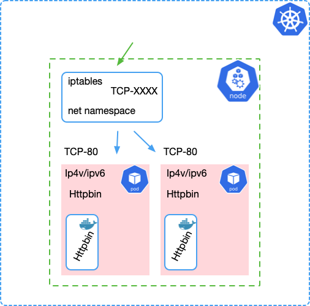
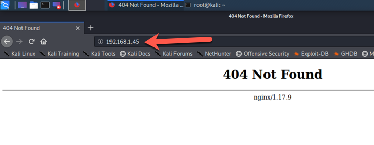

# Exercise #13 (Ingress)

## Preface:


Up until now, we have been making use of the k8s ___port-forward___ functionality to see our services and pods. In the real world clusters typically expose network ports via something called ___nodePorts___ or ___loadBalancer___.
In this exercise we will focus on "Bare Metal" scenarios, in cloud environments much of the "load balancing" confusion has been abstracted away under simple annotations, allowing admins to write one or two simple lines in there "Ingress" manifest and be done with ingress routing. I want you to know how it works so you can do it on your own. Make no mistake this is one of the most miss understood topics in kubernetes and takes people a long time to grasp.

Now lets look at what a node and pod look like without any ___nodePorts___ setup.

- First lets deploy something
```bash
# Lets deploy a set of simple web servers

cat <<EOF | kubectl apply -f -
apiVersion: apps/v1
kind: Deployment
metadata:
    name: httpbin
    labels:
      app: httpbin
spec:
  replicas: 2
  selector:
    matchLabels:
      app: httpbin
  strategy:
    type: Recreate
  template:
    metadata:
      labels:
        app: httpbin
    spec:
      containers:
      - image: kennethreitz/httpbin
        name: httpbin
        ports:
        - containerPort: 80
          name: httpbin
EOF

```
- Now we should review the deployment

```bash
# kubectl get pods -o wide
NAME                       READY   STATUS    RESTARTS   AGE   IP           NODE       NOMINATED NODE   READINESS GATES
httpbin-85d57ddd75-qp69k   1/1     Running   0          17h   172.17.0.6   minikube   <none>           <none>
httpbin-85d57ddd75-tqfdz   1/1     Running   0          17h   172.17.0.5   minikube   <none>           <none>
```
### From a network perspective, we have only invoked a node's container runtime to spin-up an image and attache it to a an internal net namespace. so it's not accessible "outside" the cluster. Even the kube-proxy has to be "attached" to this namespace via iptables bridging to allow for connectivity.

- Now lets deploy a service to sit ___out in front___ of our deployment just like before.

```bash

cat <<EOF | kubectl apply -f -
apiVersion: v1
kind: Service
metadata:
  name: httpbin-svc
  labels:
    app: httpbin
spec:
  ports:
    - port: 8888
      protocol: TCP
      targetPort: 80
  selector:
    app: httpbin
EOF

```

- By default k8s will setup the service as a ___Cluster___ resource, (see the ___ClusterIP___) i.e. Only available via ___inside___ the cluster. And you will NOT see an ___EXTERNAL-IP___

```bash
# kubectl get svc -o wide
NAME          TYPE        CLUSTER-IP      EXTERNAL-IP   PORT(S)    AGE    SELECTOR
httpbin-svc   ClusterIP   10.96.188.183   <none>        8888/TCP   14s    app=httpbin
kubernetes    ClusterIP   10.96.0.1       <none>        443/TCP    4h2m   <none>
```
- So if we wanted to we could ```kubectl port-forward``` to ```8888``` which would connect us to the upstream pods on port 80.
- But we are going to do a ___NodePort___ setup this time. To do this we will need to edit or modify the service definition. (run the first command to patch, then the second to review the change)

```bash
kubectl patch svc httpbin-svc \
        -n default \
        --type='json' -p='[{"op": "replace", "path": "/spec/type", "value":"NodePort"}]'

### display the service again to see the change
kubectl get svc -o wide

NAME          TYPE        CLUSTER-IP      EXTERNAL-IP   PORT(S)          AGE     SELECTOR
httpbin-svc   NodePort    10.96.188.183   <none>        8888:30381/TCP   9m3s    app=httpbin
kubernetes    ClusterIP   10.96.0.1       <none>        443/TCP          4h11m   <none> 
```

- See that, now we have a second ___PORT___ (on the right side of the ":" charter)
- if we want to connect to it we can just use the ___NodePort___ of ```30381``` like this. (note: your nodeport may be different)

```bash
### minikube has a command to show us this same port ...

minikube service httpbin-svc

|-----------|-------------|-------------|---------------------------|
| NAMESPACE |    NAME     | TARGET PORT |            URL            |
|-----------|-------------|-------------|---------------------------|
| default   | httpbin-svc |             | http://192.168.1.45:30381 |
|-----------|-------------|-------------|---------------------------|
```



### Now using ___NodePort___ is nice but when we use that method, k8s will ___expose the port on ALL pods it's deployed to___. In this case we only have one node but in a production environment where you might have an (external to the cluster) load balancer, it becomes difficult to track changes when ever you deploy or re-deploy ___NodePort___ changes.

### So whats the answer if ___NodePort___ is not a "production" solution? Luckily kubernetes offers another connection type called ___LoadBalencer___, however it requires a little more setup then just "patching" a service.
- First lets set our ___httpbin-svc___ back to a ___ClusterIP___ type.
```bash
### first lets look at the service defanition before the change
kubectl get svc httpbin-svc -o yaml

apiVersion: v1
kind: Service
metadata:
  annotations:
    kubectl.kubernetes.io/last-applied-configuration: |
      { ......... }
  labels:
    app: httpbin
  name: httpbin-svc
  namespace: default
spec:
  clusterIP: 10.96.188.183
  externalTrafficPolicy: Cluster
  ports:
  - nodePort: 30381
    port: 8888
    protocol: TCP
    targetPort: 80
  selector:
    app: httpbin
  sessionAffinity: None
  type: NodePort
status:
  loadBalancer: {}


### use the "patch syntax" to modify the network port type

kubectl patch svc httpbin-svc \
        -n default \
        --type='json' -p='[{"op": "remove", "path": "/spec/ports/0/nodePort"},{"op": "replace", "path": "/spec/type", "value":"ClusterIP"}]'

```
- normally this would require two steeps, first to remove the ___- nodePort: XXXX___ stanza, then to change the "type" from ___NodePort___ back to ___ClusterIP___ however I've simplified this via a two part "patch" command. 

- Run the ```  kubectl get svc httpbin-svc -o yaml  ```
- or ```  kubectl get svc httpbin-svc -o wide  ``` commands and see this change.

### Now we are back to the setup we had at the beginning of this exercise, so we can add a new kubernetes object to allow us to "connect" from "outside" the cluster. I'm alluding to the ___Ingress___ object type. To make this easier we need to add yet another resource out in front of the ___service___ a pod in and of it's self a ___"controller"___ or ___"ingress controller"___ is used to route traffic from "outside" the cluster to "inside" the cluster. Therefore all ingress controllers you will find are basically docker images of customizable reverse proxies. With names like:
- [Kong](https://github.com/Kong/kubernetes-ingress-controller)
- [Nginx](https://www.nginx.com/products/nginx/kubernetes-ingress-controller/)
- [Istio](https://istio.io/docs/tasks/traffic-management/ingress/)
- [Gloo](https://github.com/solo-io/gloo-ingress-controller)
- [Traefik](https://docs.traefik.io/)

### All have similar features parity and benefits (pros and cons), they may have differences in how they are deployed or configured. But they all basically do the same thing, which is proxy TCP (HTTP / HTTPS mostly) connections from outside to inside @ a destination or ___"backend"___ 

### For the purposes of this exercise, I'v picked [Nginx](https://www.nginx.com/products/nginx/kubernetes-ingress-controller/) as the ingress controller because I'm going to use it in several segments and want to minimize the amount of commands. However in a production environment, I would use both an ingress controller, application gateway (something like [Gloo](https://www.solo.io/products/gloo/)) AND a service mesh like [Istio](https://istio.io/). All can be used interchangeably and with each other, giving you many benefits from service and deployment control from a traffic perspective to upgrade redundancy. They extend kubernetes rolling or staged deployments to allow you to do techniques like [canary](https://whatis.techtarget.com/definition/canary-canary-testing) or [Blue / Green](https://en.wikipedia.org/wiki/Blue-green_deployment) code deployments.

### Enough talk, lets do it.
- Change directory into the ``` KernelCon2020K8s/Exercises/Build/Files/build_e13 ``` dir and ``` ls ```
```bash
ls

01-ns-and-sa.yaml                       03-default-server-secret.yaml           05-custom-resource-definitions.yaml     07-loadbalancer.yaml
02-rbac.yaml                            04-nginx-config.yaml                    06-nginx-ingress.yaml
```
- we have a number of yaml manifest files used to "deploy" the ingress controller.
- apply them in sequence
```bash
kubectl apply -f 01-ns-and-sa.yaml
kubectl apply -f 02-rbac.yaml
kubectl apply -f 03-default-server-secret.yaml
kubectl apply -f 04-nginx-config.yaml
kubectl apply -f 05-nginx-ingress.yaml
kubectl apply -f 06-loadbalancer.yaml
```
- Lets go through them and why we need them. (feel free to use the ```cat``` command to look at any of the files i.e. ```cat file.yaml```)

| Manifest | Notes |
| ---------| ----- |
01-ns-and-sa.yaml | You should deploy an ingress controller in it's own namespace AND with it's own service account for access.
02-rbac.yaml | To have a properly deployed service account you should limit its access via [role based access control](https://kubernetes.io/docs/reference/access-authn-authz/rbac/).
03-default-server-secret.yaml | To add TLS support we will need a cert and key
04-nginx-config.yaml | The base software [Nginx](https://www.nginx.com/) in this case, needs some kind of specific configuration information to know what to point to or how to run effectively.
05-custom-resource-definitions.yaml | Within k8s we would like to register additional objects and resources we can take advantage of during our deployment, also so other deployments can too.
06-nginx-ingress.yaml | This is the actual "deployment" of the Nginx software into the cluster.
07-loadbalancer.yaml | This is the ___"service"___ that will sit out front of the "backends" and do the routing. (Note: this service has the "type" set to ___"LoadBalancer"___)

### After your deployment you should have a new namespace full of stuff, something like this:
```bash
kubectl -n ingress-nginx get all


NAME                                 READY   STATUS    RESTARTS   AGE
pod/ingress-nginx-57cdc75bdb-cpk7b   1/1     Running   0          48s

NAME                    TYPE           CLUSTER-IP    EXTERNAL-IP   PORT(S)                      AGE
service/ingress-nginx   LoadBalancer   10.96.56.56   <pending>     80:32010/TCP,443:31590/TCP   45s

NAME                            READY   UP-TO-DATE   AVAILABLE   AGE
deployment.apps/ingress-nginx   1/1     1            1           48s

NAME                                       DESIRED   CURRENT   READY   AGE
replicaset.apps/ingress-nginx-57cdc75bdb   1         1         1       48s
```
- wow look at that, a new thing. Under the ___"EXTERNAL-IP"___ column there is a ___"pending"___ note. (what does that mean?)

### In a cloud based deployment, kubernetes would have registered ___annotations___ pointing to an external network load balancer, essentially another pod that watches for kubernetes events where the Service Type of "LoadBalancer" is deployed and then communicates the needed ports to open, setup an IP address etc. In a "Bare Metal" deployment you can use an L2 based network load balancer or something like [MetalLB](https://metallb.universe.tf/) to do the same.

- In our minikube environment we can just manually edit the IP address and set it with a patch command.

```bash
ifconfig eth0 |grep -i "inet " |awk '{print $2}'

192.168.1.45

### now take the IP you just got from the last command and 

kubectl patch svc ingress-nginx \
        -n ingress-nginx \
        -p '{"spec": {"type": "LoadBalancer", "externalIPs":["192.168.1.45"]}}'

### now lets review the service again

kubectl -n ingress-nginx get svc

NAME            TYPE           CLUSTER-IP    EXTERNAL-IP    PORT(S)                      AGE
ingress-nginx   LoadBalancer   10.96.56.56   192.168.1.45   80:32010/TCP,443:31590/TCP   32m
```
- see that now the ___"EXTERNAL-IP"___ is now a real IP not ___pending___
- cool lets see if we can hit the site



### Wait, what?? (Why not it work) ???
Well there is one more resource we need to deploy to "connect" the external network load balancer and the internal service definition. For this we want to make use of the ___"Ingress"___ resource. It's a manifest where we can define some specific about how we want traffic routed and secured.

- lets build and deploy a "Ingress" manifest to connect them together.

```bash

cat <<EOF | kubectl apply --filename -
apiVersion: extensions/v1beta1
kind: Ingress
metadata:
  annotations:
    nginx.ingress.kubernetes.io/rewrite-target: /$2
  generation: 3
  name: rewrite
  namespace: default
spec:
  rules:
  - host: k8s.kernelcon2020.org
    http:
      paths:
      - backend:
          serviceName: httpbin-svc
          servicePort: 8888
        path: /
EOF

### and lets add a host name into our "hosts" file for name resolusion (don't forget to use the same IP you found eariler)

echo "192.168.1.45     k8s.kernelcon2020.org" >> /etc/hosts

```
- Now what about TLS ???

```bash

cat <<EOF | kubectl apply --filename -
apiVersion: extensions/v1beta1
kind: Ingress
metadata:
  annotations:
    nginx.ingress.kubernetes.io/rewrite-target: /$2
  generation: 3
  name: rewrite
  namespace: default
spec:
  tls:
    - hosts:
      - k8s.kernelcon2020.org
      secretName: star-kernelcon2020-org-tls
  rules:
  - host: k8s.kernelcon2020.org
    http:
      paths:
      - backend:
          serviceName: httpbin-svc
          servicePort: 8888
        path: /
EOF
```


## Review:
The default "North / South" networking design is to keep packets "inside" the cluster. It's only when you "attach" custom or special reverse proxy containers into the deployment that you can get packets from outside to inside and vice versa. Incidentally all the networking going "North / South" must go through ___"kube-proxy"___ if you were to do a command like ``` netstat -lnop |grep -i kube``` you would see the ___kube-proxy___ service attached to the ports we opened for 80 or 443 or what ever your NodePort was, all of it goes through ___kube-proxy___.   


## Clean up:
  No clean up after this exercise, we want to re-use then in the next one.


[Return to schedule](../../Docs/SCHEDULE.md)