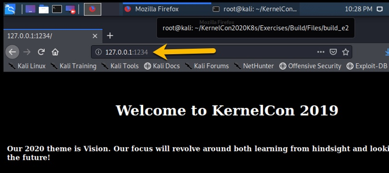

# Exercise #4

## Defending your developer against your attacker.

### Preface: 

#### Here we go...

- Change directory so you are in the __<REPO_ROOT>/Exercises/Defend/Files/defend_e4/__ directory.
- do an ```ls``` command to make sure, should see:
```
about.html      defend_e4.yml    dsvw.py     index.html
```
This is the __same__ code sample as before, just copied here for completeness and to keep stuff separate. Anyway ~
- let us __edit__ that __defend_e4.yml__ file.
```
version: "3.7"
services:
  dsvw:
    cap_add:  <- Change to cap_drop
        - ALL
    ports:
        - "1234:8000"
    image: registry.gitlab.com/denver.cfman/kernelcon2020k8s/dsvw:v0.1m
    command: ["python","/app/dsvw.py"]
    volumes:
        - ./:/app:rw  <- change to "ro"
```
It should look like this
```
version: "3.7"
services:
  dsvw:
    cap_drop:
        - ALL
    ports:
        - "1234:8000"
    image: registry.gitlab.com/denver.cfman/kernelcon2020k8s/dsvw:v0.1m
    command: ["python","/app/dsvw.py"]
    volumes:
        - ./:/app:ro
```

- Run the docker-compose command with our __edited__ definition file.
```
docker-compose -f defend_e4.yml up -d
```
This will start up a docker container with our app running inside it. Now navigate your web browser to view it.
You can do this in many ways, but two come to mind. Use either your "host" browser or make use of the firefox browser within kali linux.

To use your host browser, you will need to find your kali linux IP with a command something like this:

or just find it via the ```ifconfig eth0``` command.
Or again make use of the firefox browser within kali linux:


Then navigate to your new dev site: ```http://127.0.0.1:1234```


Or use your Host browser if you want ```http://<kali ip>:1234/```

#### Go ahead; try that same exploit:
```
http://<your IP>:1234/?domain=kernelcon.org%3B%20echo%20%22(%E2%95%AF%C2%B0%E2%96%A1%C2%B0)%E2%95%AF%EF%B8%B5%20%E2%94%BB%E2%94%81%E2%94%BB%22%20%3E%20app%2Fabout.html
```
#### Did it work?
#### Try to edit one of the files like __index.html__ to address the incorrect date, see a dev can still use it as a rapid development environment; i.e. edit/run, they just need to add some security related functionality so they don't get powned!

#### When you are done, just pull down your dev. env. via the __docker-compose__ command again.
```
docker-compose -f defend_e4.yml down
```

[Return to schedule](../../Docs/SCHEDULE.md)
